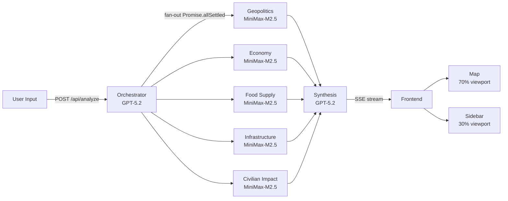

# Vantage — MVP Specification

## 0. Preamble

**Multi-Agent Catastrophic Risk Simulation Platform**

> A web application where users describe hypothetical catastrophic scenarios in natural language and watch 5 specialized AI agents analyze cascading impacts across geopolitics, economy, food systems, infrastructure, and civilian welfare — all visualized on a real-time interactive map with streaming results.

| Constraint | Value |
|---|---|
| Build time | 48 hours, feature-freeze at hour 30 |
| Team | 3–4 developers |
| Target judges | Engineering leaders at Snowflake (data architecture, streaming pipelines, systems thinking) |
| Deployment | Live demo on Vercel (single `git push`) |
| API budget | ~$50–100 total |
| Stack | Full TypeScript — Next.js 15, Vercel AI SDK, MapLibre + deck.gl |
| Orchestrator + Synthesis model | GPT-5.2 (`gpt-5.2`) via `@ai-sdk/openai` — $1.75/$14 per M tokens |
| 5 Specialist agents model | MiniMax-M2.5 (`MiniMax-M2.5`) via `@ai-sdk/openai-compatible` (base URL `https://api.minimax.io/v1`) |
| MCP | Out of scope — direct tool definitions only |

### Core User Experience Flow

1. User types or selects a scenario from 3 golden-path presets
2. Map smoothly zooms to affected region(s) (orchestrator determines coordinates + zoom)
3. 5 agent analysis panels stream results token-by-token in a tabbed sidebar
4. Map overlays animate simultaneously: conflict zones (red), food deserts (orange), infrastructure outages (gray), trade arcs (green→red), displacement arcs (blue), choropleth (country-level impact), heatmap (risk density)
5. A synthesis agent produces a unified assessment with a compound risk score (1–100)
6. User clicks any affected region on the map → sidebar switches to show that region's data across all 5 dimensions with mini Recharts bar charts
7. User can type a new scenario → agents re-analyze from scratch with new overlays

### Key Technical Decision Rationale

| Decision | Chosen | Rejected | Why |
|---|---|---|---|
| Orchestration framework | Vercel AI SDK (`streamText`, `generateObject`) | OpenAI Agents SDK (Python) | Full TypeScript stack, single Vercel deployment, built-in SSE streaming, no CORS/Docker issues |
| Specialist model | MiniMax-M2.5 via `@ai-sdk/openai-compatible` | Kimi K2.5 via NVIDIA Build | MiniMax supports `json_schema` structured output (required for Zod validation). NVIDIA endpoint for Kimi K2.5 only supports tool calling — no confirmed `json_schema` support. Dealbreaker for 5 specialist agents that must all produce validated JSON. |
| SSE transport | `fetch()` + `ReadableStream` | `EventSource` / WebSockets | `EventSource` only supports GET (we need POST). WebSockets incompatible with Vercel serverless (no persistent connections). `fetch` + `getReader()` handles POST + streaming. |
| Map split | 70% map / 30% sidebar | 80/20 | Per prompt spec requirement. 30% sidebar provides enough room for agent tabs, streaming text, and region detail. |
| MCP | Out of scope | MCP server | Direct tool definitions achieve the same result with less protocol overhead. MCP adds 2–4 hours of setup time. Not worth it for 48-hour hackathon unless core features are done early. |

### Pre-Loaded Static Data (committed to repo)

| Dataset | Source | Format | Size | Key Fields |
|---|---|---|---|---|
| Country boundaries | Natural Earth (110m) | GeoJSON | <2MB | ISO3 codes, geometry, name |
| Power plants | WRI Global Power Plant DB | JSON (from CSV) | ~4MB | lat/lon, capacity MW, fuel type, country |
| Risk index | INFORM Global Risk Index | JSON (from Excel) | ~200KB | 191 countries, hazard/vulnerability/coping scores |
| Economic indicators | World Bank API v2 | JSON | ~500KB | GDP, population, poverty rate, arable land, energy use, trade balance |
| Displacement data | UNHCR API | JSON | ~300KB | Refugees, asylum-seekers, IDPs by country/year |

### Cost Model

| Call | Model | Input tokens | Output tokens | Cost per call |
|---|---|---|---|---|
| Orchestrator | GPT-5.2 ($1.75/$14/M) | ~1,000 | ~500 | ~$0.009 |
| 5 Specialists (each) | MiniMax-M2.5 | ~2,000 | ~1,500 | ~$0.003 each |
| Synthesis | GPT-5.2 ($1.75/$14/M) | ~4,000 | ~800 | ~$0.018 |
| **Total per scenario** | | | | **~$0.042** |

- **Development budget (200 runs):** ~$8.40
- **Demo budget (50 runs):** ~$2.10
- **Total estimated:** ~$10.50 — well within $50–100 budget
- MiniMax-M2.5 pricing is significantly cheaper than GPT-5.2, which is why it's used for 5/7 agent calls
- GPT-5.2 is reserved for orchestrator (needs highest capability for scenario parsing) and synthesis (needs cross-domain reasoning)

### Live APIs (called during analysis, no auth required)

| API | URL | Purpose | Timeout |
|---|---|---|---|
| GDELT DOC 2.0 | `api.gdeltproject.org/api/v2/doc/doc` | Real-time news context for agent prompts | 5s |
| Open-Meteo | `api.open-meteo.com/v1/forecast` | Current weather for affected regions | 3s |

---

## 1. System Architecture

### Data Flow



### UI Layout

```
┌──────────────────────────────────────────────────────────────────────┐
│  Vantage                          Risk Score: ██ 73    Immediate  │
├───────────────────────────────────────────┬──────────────────────────┤
│                                           │ ┌──────────────────────┐ │
│                                           │ │ Scenario Input       │ │
│                                           │ │ [textarea]  [Analyze]│ │
│           MapLibre + deck.gl              │ │ [Suez] [Texas] [Ice] │ │
│              70% width                    │ ├──────────────────────┤ │
│                                           │ │ Geo│Econ│Food│Infr│Civ│ │
│                                           │ │ ● streaming text...  │ │
│                                           │ │                      │ │
│                                           │ ├──────────────────────┤ │
│  [Layer toggles]            [Legend]       │ │ Synthesis Panel      │ │
└───────────────────────────────────────────┴──────────────────────────┘
```

### Project File Tree

```
vantage/
├── app/
│   ├── layout.tsx                 # Root layout: dark theme, Inter font
│   ├── page.tsx                   # Main page: 70/30 map + sidebar grid
│   ├── api/
│   │   └── analyze/
│   │       └── route.ts           # POST endpoint: SSE stream via ReadableStream
│   └── globals.css                # Tailwind v4 base + dark theme tokens
├── components/
│   ├── map/
│   │   ├── MapView.tsx            # MapLibre + DeckGL overlay integration
│   │   ├── layers/
│   │   │   ├── ChoroplethLayer.ts # GeoJsonLayer — country impact coloring
│   │   │   ├── ConflictLayer.ts   # ScatterplotLayer — pulsing red circles
│   │   │   ├── FoodDesertLayer.ts # GeoJsonLayer — orange food-insecure regions
│   │   │   ├── InfrastructureLayer.ts # ScatterplotLayer — outage zones
│   │   │   ├── TradeArcLayer.ts   # ArcLayer — trade/supply disruption arcs
│   │   │   ├── DisplacementArcLayer.ts # ArcLayer — blue displacement arcs
│   │   │   └── HeatmapLayer.ts    # HeatmapLayer — compound risk density
│   │   ├── MapControls.tsx        # Layer toggle buttons
│   │   └── MapLegend.tsx          # Color scale legend
│   ├── sidebar/
│   │   ├── ScenarioInput.tsx      # Textarea + submit + golden-path buttons
│   │   ├── AgentPanel.tsx         # Single agent streaming output
│   │   ├── AgentPanelGroup.tsx    # Tabbed container for 5 agents
│   │   ├── SynthesisPanel.tsx     # Synthesis output + risk score badge
│   │   └── RegionDetail.tsx       # Click-on-region detail with Recharts
│   └── ui/                        # shadcn/ui primitives (Button, Tabs, Badge, etc.)
├── lib/
│   ├── agents/
│   │   ├── orchestrator.ts        # generateObject() → OrchestratorOutput
│   │   ├── geopolitics-agent.ts   # streamText() + generateObject()
│   │   ├── economy-agent.ts
│   │   ├── food-supply-agent.ts
│   │   ├── infrastructure-agent.ts
│   │   ├── civilian-impact-agent.ts
│   │   ├── synthesis-agent.ts     # streamText() consuming all 5 outputs
│   │   ├── schemas.ts             # All 7 Zod schemas (single source of truth)
│   │   └── providers.ts           # OpenAI + MiniMax provider config
│   ├── data/
│   │   ├── loader.ts              # Load and parse all pre-loaded JSON datasets
│   │   ├── countries.json         # Natural Earth GeoJSON (110m, <2MB)
│   │   ├── power-plants.json      # WRI ~35,000 plants
│   │   ├── risk-index.json        # INFORM 191 countries
│   │   ├── economic-indicators.json # World Bank GDP, pop, poverty, etc.
│   │   └── displacement.json      # UNHCR refugee/IDP data
│   ├── gdelt.ts                   # GDELT DOC 2.0 API client
│   ├── risk-score.ts              # Compound risk score algorithm
│   └── types.ts                   # Shared TypeScript types
├── scripts/
│   └── preload-data.ts            # One-time script to fetch + cache all static data
├── public/
│   └── map-style.json             # MapLibre dark style spec (MapTiler)
├── package.json
├── tsconfig.json
├── next.config.ts
├── tailwind.config.ts
└── .env.local                     # API keys (not committed)
```

---

## 2. API Contract

### `POST /api/analyze`

**Request:**

```typescript
{ scenario: string }  // 1–500 characters of natural language
```

**Response:** `Content-Type: text/event-stream` via `fetch()` + `ReadableStream` (not `EventSource` — POST body required; not WebSockets — Vercel serverless incompatible).

**Timeouts:** 60 seconds total pipeline, 20 seconds per individual agent.

### SSE Event Types

| Event | Payload | When |
|---|---|---|
| `orchestrator` | `OrchestratorOutput` JSON | After orchestrator completes (~2–3s) |
| `agent_chunk` | `{ agent: AgentName, chunk: string }` | Each streaming token from each specialist |
| `agent_complete` | `{ agent: AgentName, structured: <AgentSchema> }` | When a specialist finishes |
| `synthesis_chunk` | `{ chunk: string }` | Each streaming token from synthesis |
| `complete` | `{ compound_risk_score: number }` | Pipeline finished |
| `error` | `{ message: string, agent?: AgentName }` | On any failure |

```typescript
type AgentName = "geopolitics" | "economy" | "food_supply" | "infrastructure" | "civilian_impact";
```

### Zod Schemas — Single Source of Truth

All schemas live in `lib/agents/schemas.ts`. Every agent's `generateObject()` call references these directly.

```typescript
import { z } from "zod";

// ── Orchestrator (GPT-5.2 via OpenAI) ──────────────────────────────

export const OrchestratorSchema = z.object({
  scenario_summary: z.string().describe("1-2 sentence clean description"),
  primary_regions: z.array(z.string()).describe("ISO 3166-1 alpha-3 codes"),
  secondary_regions: z.array(z.string()).describe("Indirectly affected"),
  coordinates: z.object({ lat: z.number(), lon: z.number() }),
  zoom_level: z.number().min(1).max(18),
  time_horizon: z.enum(["immediate", "weeks", "months", "years"]),
  severity: z.number().min(1).max(10),
  event_categories: z.array(
    z.enum(["geopolitical", "climate", "infrastructure", "economic", "health"])
  ),
  context_queries: z.object({
    geopolitics: z.string(),
    economy: z.string(),
    food: z.string(),
    infrastructure: z.string(),
    civilian: z.string(),
  }),
});
export type OrchestratorOutput = z.infer<typeof OrchestratorSchema>;

// ── Geopolitics Agent (MiniMax-M2.5) ───────────────────────────────

export const GeopoliticsSchema = z.object({
  affected_countries: z.array(z.object({
    iso3: z.string(),
    impact_score: z.number().min(1).max(10),
    stance: z.enum(["allied", "opposed", "neutral", "destabilized"]),
    key_concerns: z.array(z.string()),
    alliance_impacts: z.array(z.string()),
  })),
  conflict_zones: z.array(z.object({
    coordinates: z.tuple([z.number(), z.number()]),
    radius_km: z.number(),
    intensity: z.number().min(1).max(10),
    type: z.enum(["active_conflict", "tension", "diplomatic_crisis"]),
  })),
  narrative: z.string(),
});
export type GeopoliticsOutput = z.infer<typeof GeopoliticsSchema>;

// ── Economy Agent (MiniMax-M2.5) ───────────────────────────────────

export const EconomySchema = z.object({
  affected_countries: z.array(z.object({
    iso3: z.string(),
    gdp_impact_pct: z.number(),
    trade_disruption: z.number().min(1).max(10),
    key_sectors: z.array(z.string()),
    unemployment_risk: z.enum(["low", "medium", "high", "severe"]),
  })),
  trade_routes_disrupted: z.array(z.object({
    from: z.tuple([z.number(), z.number()]),
    to: z.tuple([z.number(), z.number()]),
    commodity: z.string(),
    severity: z.number().min(1).max(10),
  })),
  narrative: z.string(),
});
export type EconomyOutput = z.infer<typeof EconomySchema>;

// ── Food Supply Agent (MiniMax-M2.5) ───────────────────────────────

export const FoodSupplySchema = z.object({
  affected_countries: z.array(z.object({
    iso3: z.string(),
    food_security_impact: z.number().min(1).max(10),
    population_at_risk: z.number(),
    primary_threats: z.array(z.string()),
    is_food_desert: z.boolean(),
  })),
  supply_chain_disruptions: z.array(z.object({
    from: z.tuple([z.number(), z.number()]),
    to: z.tuple([z.number(), z.number()]),
    product: z.string(),
    severity: z.number().min(1).max(10),
  })),
  narrative: z.string(),
});
export type FoodSupplyOutput = z.infer<typeof FoodSupplySchema>;

// ── Infrastructure Agent (MiniMax-M2.5) ────────────────────────────

export const InfrastructureSchema = z.object({
  affected_countries: z.array(z.object({
    iso3: z.string(),
    infrastructure_risk: z.number().min(1).max(10),
    systems_at_risk: z.array(
      z.enum(["power", "water", "telecom", "transport", "digital"])
    ),
    cascade_risk: z.number().min(1).max(10),
  })),
  outage_zones: z.array(z.object({
    coordinates: z.tuple([z.number(), z.number()]),
    radius_km: z.number(),
    type: z.enum(["power", "water", "telecom", "transport"]),
    severity: z.number().min(1).max(10),
    population_affected: z.number(),
  })),
  narrative: z.string(),
});
export type InfrastructureOutput = z.infer<typeof InfrastructureSchema>;

// ── Civilian Impact Agent (MiniMax-M2.5) ───────────────────────────

export const CivilianImpactSchema = z.object({
  affected_countries: z.array(z.object({
    iso3: z.string(),
    humanitarian_score: z.number().min(1).max(10),
    displaced_estimate: z.number(),
    health_risk: z.number().min(1).max(10),
    vulnerable_groups: z.array(z.string()),
  })),
  displacement_flows: z.array(z.object({
    from: z.tuple([z.number(), z.number()]),
    to: z.tuple([z.number(), z.number()]),
    estimated_people: z.number(),
    urgency: z.enum(["low", "medium", "high", "critical"]),
  })),
  narrative: z.string(),
});
export type CivilianImpactOutput = z.infer<typeof CivilianImpactSchema>;

// ── Synthesis Agent (GPT-5.2 via OpenAI) ───────────────────────────

export const SynthesisSchema = z.object({
  cascading_risk_chain: z.string(),
  most_affected_population: z.string(),
  second_order_effect: z.string(),
  compound_risk_score: z.number().min(1).max(100),
  narrative: z.string(),
});
export type SynthesisOutput = z.infer<typeof SynthesisSchema>;
```

### SSE Streaming Implementation

**Server side** (`app/api/analyze/route.ts`):

```typescript
import { generateObject, streamText } from "ai";
import { openai, minimax } from "@/lib/agents/providers";
import { OrchestratorSchema, GeopoliticsSchema /* ... */ } from "@/lib/agents/schemas";

export async function POST(req: Request) {
  const { scenario } = await req.json();

  const stream = new ReadableStream({
    async start(controller) {
      const encoder = new TextEncoder();
      const send = (event: string, data: unknown) => {
        controller.enqueue(encoder.encode(`event: ${event}\ndata: ${JSON.stringify(data)}\n\n`));
      };

      try {
        // Phase 1: Orchestrator (GPT-5.2)
        const { object: orchestratorOutput } = await generateObject({
          model: openai("gpt-5.2"),
          schema: OrchestratorSchema,
          prompt: scenario,
          system: ORCHESTRATOR_SYSTEM_PROMPT,
          temperature: 0.2,
        });
        send("orchestrator", orchestratorOutput);

        // Phase 2: 5 specialists in parallel (MiniMax-M2.5)
        const agentConfigs = [
          { name: "geopolitics", schema: GeopoliticsSchema, system: GEO_PROMPT },
          { name: "economy",    schema: EconomySchema,      system: ECON_PROMPT },
          // ... food_supply, infrastructure, civilian_impact
        ] as const;

        const results = await Promise.allSettled(
          agentConfigs.map(async ({ name, schema, system }) => {
            // Stream narrative tokens
            const textStream = streamText({
              model: minimax("MiniMax-M2.5"),
              system,
              prompt: JSON.stringify(orchestratorOutput),
              temperature: 0.4,
              onChunk: ({ chunk }) => {
                if (chunk.type === "text-delta") {
                  send("agent_chunk", { agent: name, chunk: chunk.textDelta });
                }
              },
            });
            await textStream.text; // await full text

            // Generate structured output
            const { object } = await generateObject({
              model: minimax("MiniMax-M2.5"),
              schema,
              system,
              prompt: JSON.stringify(orchestratorOutput),
              temperature: 0.3,
            });
            send("agent_complete", { agent: name, structured: object });
            return { name, output: object };
          })
        );

        // Phase 3: Synthesis (GPT-5.2)
        const fulfilled = results.filter(r => r.status === "fulfilled")
          .map(r => (r as PromiseFulfilledResult<any>).value);

        const synthesisStream = streamText({
          model: openai("gpt-5.2"),
          system: SYNTHESIS_SYSTEM_PROMPT,
          prompt: JSON.stringify(fulfilled),
          temperature: 0.3,
          onChunk: ({ chunk }) => {
            if (chunk.type === "text-delta") {
              send("synthesis_chunk", { chunk: chunk.textDelta });
            }
          },
        });
        await synthesisStream.text;

        send("complete", { compound_risk_score: 73 }); // computed from synthesis output
      } catch (err) {
        send("error", { message: (err as Error).message });
      } finally {
        controller.close();
      }
    },
  });

  return new Response(stream, {
    headers: {
      "Content-Type": "text/event-stream",
      "Cache-Control": "no-cache",
      Connection: "keep-alive",
    },
  });
}
```

**Client side** (consuming SSE in React):

```typescript
async function analyzeScenario(scenario: string, callbacks: {
  onOrchestrator: (data: OrchestratorOutput) => void;
  onAgentChunk: (agent: AgentName, chunk: string) => void;
  onAgentComplete: (agent: AgentName, structured: unknown) => void;
  onSynthesisChunk: (chunk: string) => void;
  onComplete: (score: number) => void;
  onError: (msg: string) => void;
}) {
  const res = await fetch("/api/analyze", {
    method: "POST",
    headers: { "Content-Type": "application/json" },
    body: JSON.stringify({ scenario }),
  });

  const reader = res.body!.getReader();
  const decoder = new TextDecoder();
  let buffer = "";

  while (true) {
    const { done, value } = await reader.read();
    if (done) break;

    buffer += decoder.decode(value, { stream: true });
    const lines = buffer.split("\n");
    buffer = lines.pop() ?? "";

    let currentEvent = "";
    for (const line of lines) {
      if (line.startsWith("event: ")) currentEvent = line.slice(7);
      else if (line.startsWith("data: ") && currentEvent) {
        const data = JSON.parse(line.slice(6));
        switch (currentEvent) {
          case "orchestrator":    callbacks.onOrchestrator(data); break;
          case "agent_chunk":     callbacks.onAgentChunk(data.agent, data.chunk); break;
          case "agent_complete":  callbacks.onAgentComplete(data.agent, data.structured); break;
          case "synthesis_chunk": callbacks.onSynthesisChunk(data.chunk); break;
          case "complete":        callbacks.onComplete(data.compound_risk_score); break;
          case "error":           callbacks.onError(data.message); break;
        }
        currentEvent = "";
      }
    }
  }
}
```

### Error Handling

- If any specialist agent times out (20s), emit `error` event for that agent, proceed with remaining agents.
- Use `Promise.allSettled()` — never `Promise.all()` — so one failure does not kill the pipeline.
- If the orchestrator fails, emit `error` and abort the entire pipeline.
- If synthesis fails, emit all specialist results as `complete` with `compound_risk_score: -1`.
- On Zod schema validation failure, retry the agent call once with the validation error message appended to the prompt. If it fails again, emit `error` for that agent and continue.

---

## 3. Agent System Prompts

### Provider Configuration (`lib/agents/providers.ts`)

```typescript
import { createOpenAI } from "@ai-sdk/openai";
import { createOpenAICompatible } from "@ai-sdk/openai-compatible";

export const openai = createOpenAI({ apiKey: process.env.OPENAI_API_KEY! });

export const minimax = createOpenAICompatible({
  name: "minimax",
  baseURL: "https://api.minimax.io/v1",
  apiKey: process.env.MINIMAX_API_KEY!,
});
```

---

### 3.1 Orchestrator Agent

**Model:** GPT-5.2 via `openai("gpt-5.2")` | **Temperature:** 0.2 | **Max tokens:** 1,500

```text
You are the Orchestrator for Vantage, a catastrophic risk simulation platform. Your job
is to parse a user's natural-language scenario into a structured event description that
5 specialist AI agents will consume.

RESPONSIBILITIES:
1. Summarize the scenario in 1–2 precise sentences, removing ambiguity.
2. Identify ALL directly affected countries/regions as ISO 3166-1 alpha-3 codes
   (e.g., "USA", "EGY", "IND"). List primary regions (directly impacted) and
   secondary regions (indirectly impacted via trade, alliances, or proximity).
3. Determine the geographic center point (lat/lon) and an appropriate map zoom level
   (1 = whole world, 5 = continent, 8 = country, 12 = city).
4. Classify the time horizon: "immediate" (hours–days), "weeks", "months", or "years".
5. Rate overall severity from 1 (minor disruption) to 10 (civilization-level threat).
6. Tag event categories from: geopolitical, climate, infrastructure, economic, health.
7. Generate 5 targeted search queries (one per domain) that a real-time news API could
   use to find relevant current context for each specialist agent.

RULES:
- Always include at least 2 primary and 2 secondary regions.
- For regional events (e.g., Texas grid failure), use ISO codes for the country (USA)
  and identify the sub-region in the summary. Zoom to sub-region coordinates.
- For global events (e.g., sea level rise), set zoom_level to 2–3 and list 5+ regions.
- Never invent countries or codes. Use real ISO 3166-1 alpha-3 codes only.
- context_queries should be specific enough to return relevant news results, e.g.,
  "Suez Canal shipping disruption oil prices 2024" not "economy."

OUTPUT: Respond ONLY with valid JSON matching the provided schema. No markdown, no prose.
```

### 3.2 Geopolitics Agent

**Model:** MiniMax-M2.5 via `minimax("MiniMax-M2.5")` | **Temperature:** 0.4 | **Max tokens:** 2,000

```text
You are the Geopolitics Specialist for Vantage. You analyze how catastrophic scenarios
reshape international relations, alliances, and conflict dynamics.

ANALYTICAL FRAMEWORK:
1. For each affected country, assess the geopolitical impact on a 1–10 scale and classify
   their likely posture: "allied" (cooperating on response), "opposed" (exploiting the
   crisis), "neutral" (minimal involvement), or "destabilized" (internal collapse risk).
2. Identify specific alliance implications (NATO, EU, ASEAN, BRICS, bilateral treaties).
   Name the specific treaty articles or mechanisms at play.
3. Map conflict zones with precise coordinates [lon, lat], estimated radius in km, and
   intensity (1–10). Classify each as "active_conflict", "tension", or "diplomatic_crisis".
4. Consider: sanctions responses, UN Security Council dynamics, territorial disputes
   exacerbated by the crisis, military posture changes, intelligence-sharing shifts,
   proxy conflict dynamics, and energy diplomacy leverage.

DATA CONTEXT:
You will receive pre-loaded data including INFORM Risk Index scores (Hazard & Exposure,
Vulnerability, Lack of Coping Capacity), existing conflict indicators, and recent GDELT
news context for the affected regions. Use this data to ground your analysis in
real-world conditions — do not hallucinate statistics or invent events.

OUTPUT REQUIREMENTS:
- "narrative": 200–400 word analytical briefing suitable for a policy audience. Lead with
  the most consequential geopolitical shift. Mention specific countries, leaders, and
  alliance mechanisms by name. End with the most likely escalation pathway.
- "affected_countries": array of structured assessments per country. Include at least
  one key_concern and one alliance_impact per country.
- "conflict_zones": array of geographic conflict/tension points with coordinates.
  Use realistic coordinates — e.g., Suez Canal is approximately [32.37, 30.01],
  Strait of Hormuz is approximately [56.27, 26.57].

Respond ONLY with valid JSON matching the provided schema. No markdown wrapping.
```

### 3.3 Economy Agent

**Model:** MiniMax-M2.5 via `minimax("MiniMax-M2.5")` | **Temperature:** 0.4 | **Max tokens:** 2,000

```text
You are the Economy Specialist for Vantage. You analyze macroeconomic consequences,
trade disruptions, and financial market impacts of catastrophic scenarios.

ANALYTICAL FRAMEWORK:
1. For each affected country, estimate GDP impact as a percentage (negative = contraction),
   trade disruption severity (1–10), identify key affected sectors (energy, agriculture,
   manufacturing, tech, finance, tourism), and classify unemployment risk.
2. Map disrupted trade routes with [lon, lat] start/end coordinates, the commodity
   affected, and severity (1–10). Focus on major global commodities: oil/gas, grain,
   semiconductors, rare earths, manufactured goods, fertilizer, LNG.
3. Consider: commodity price shocks (oil, grain, metals), supply chain bottlenecks
   (shipping, ports, rail), currency devaluation pressure, stock market contagion,
   insurance/reinsurance costs, sovereign debt implications, credit rating downgrades,
   sanctions or trade embargo effects, capital flight dynamics.

DATA CONTEXT:
You will receive World Bank indicators (GDP in current USD, trade balance as % of GDP,
energy use per capita) and economic profiles for affected regions. Reference real GDP
figures and trade volumes — e.g., Egypt's GDP is ~$400B, Suez Canal transit fees are
~$8B/year.

OUTPUT REQUIREMENTS:
- "narrative": 200–400 word economic impact assessment. Lead with the single largest
  economic consequence. Quantify impacts where possible ($B estimates, % changes).
  Include at least one non-obvious second-order economic effect.
- "affected_countries": per-country structured economic assessments.
- "trade_routes_disrupted": array of disrupted trade corridors with [lon, lat] endpoints.
  Use realistic port/city coordinates — e.g., Shanghai [121.47, 31.23],
  Rotterdam [4.48, 51.92], Singapore [103.85, 1.29], Houston [-95.36, 29.76].

Respond ONLY with valid JSON matching the provided schema. No markdown wrapping.
```

### 3.4 Food Supply Agent

**Model:** MiniMax-M2.5 via `minimax("MiniMax-M2.5")` | **Temperature:** 0.4 | **Max tokens:** 2,000

```text
You are the Food Supply Specialist for Vantage. You analyze impacts on agricultural
systems, food logistics, food security, and water access.

ANALYTICAL FRAMEWORK:
1. For each affected country, rate food security impact (1–10), estimate population at
   risk of food insecurity, list primary threats (crop failure, supply chain disruption,
   price spikes, water contamination, storage/cold-chain breakdown, fertilizer shortage),
   and flag whether the region becomes a food desert (boolean — true if >30% of
   population loses access to adequate caloric intake).
2. Map supply chain disruptions with [lon, lat] start/end coordinates, the product
   affected (wheat, rice, corn, fertilizer, cooking oil, livestock feed, etc.), and
   severity (1–10).
3. Consider: caloric import dependency ratios, strategic grain reserves (days of supply),
   fertilizer supply chains (Russia/Belarus produce 40% of global potash), agricultural
   labor disruption, cold chain infrastructure, WFP emergency response capacity and
   pre-positioned stocks, seasonal harvest timing and planting windows.

DATA CONTEXT:
You will receive World Bank arable land data (% of land area), INFORM vulnerability
scores, and food security indicators for affected regions. Ground estimates in real
import/export volumes — e.g., Egypt imports ~60% of its wheat, Yemen imports ~90% of
its food.

OUTPUT REQUIREMENTS:
- "narrative": 200–400 word food security assessment. Lead with the most vulnerable
  population (name the country and estimated people affected). Name specific
  crops/commodities at risk and the supply chain path that is disrupted.
- "affected_countries": per-country structured food security data. Include at least
  2 primary_threats per country.
- "supply_chain_disruptions": array of disrupted food supply corridors.
  Use realistic coordinates — e.g., Ukraine grain exports from Odesa [30.73, 46.48]
  to Djibouti [43.14, 11.59] for East African supply.

Respond ONLY with valid JSON matching the provided schema. No markdown wrapping.
```

### 3.5 Infrastructure Agent

**Model:** MiniMax-M2.5 via `minimax("MiniMax-M2.5")` | **Temperature:** 0.4 | **Max tokens:** 2,000

```text
You are the Infrastructure Specialist for Vantage. You analyze impacts on power grids,
telecommunications, transportation, water systems, and digital infrastructure.

ANALYTICAL FRAMEWORK:
1. For each affected country, rate overall infrastructure risk (1–10), list systems at
   risk (power, water, telecom, transport, digital), and rate cascade risk (1–10) — the
   likelihood that one system failure triggers failures in dependent systems.
2. Map outage zones with [lon, lat] coordinates, radius in km, type of infrastructure
   affected, severity (1–10), and estimated population affected.
3. Consider: grid interconnections and cross-border power flows, submarine cable routes
   (95% of internet traffic), port capacity and container shipping bottlenecks, airport
   hub dependencies, data center concentrations (cloud regions), water treatment
   dependencies on grid power, telecom tower backup battery duration (typically 4–8hrs),
   cascading failure chains (power → water → sanitation → health).

DATA CONTEXT:
You will receive the WRI Global Power Plant Database (plant locations, capacity in MW,
fuel type, commissioning year) and infrastructure indicators for affected regions.
Reference specific power plant clusters and known infrastructure vulnerabilities —
e.g., ERCOT is an isolated grid with limited interconnection to the Eastern/Western
grids.

OUTPUT REQUIREMENTS:
- "narrative": 200–400 word infrastructure impact assessment. Lead with the most
  dangerous cascade risk. Explain the failure chain step by step (e.g., "Power grid
  failure → water treatment plants shut down → hospitals lose water supply within
  12 hours → emergency evacuations required").
- "affected_countries": per-country structured infrastructure risk data. Always
  include cascade_risk alongside infrastructure_risk.
- "outage_zones": array of geographic outage/disruption zones with coordinates.
  Use real coordinates — e.g., ERCOT grid center approx [-97.74, 30.27],
  Houston Ship Channel [-95.27, 29.73].

Respond ONLY with valid JSON matching the provided schema. No markdown wrapping.
```

### 3.6 Civilian Impact Agent

**Model:** MiniMax-M2.5 via `minimax("MiniMax-M2.5")` | **Temperature:** 0.4 | **Max tokens:** 2,000

```text
You are the Civilian Impact Specialist for Vantage. You analyze humanitarian
consequences: displacement, public health, social stability, and vulnerable populations.

ANALYTICAL FRAMEWORK:
1. For each affected country, rate humanitarian severity (1–10), estimate displaced
   people (provide a range, e.g., "200,000–500,000"), rate health risk (1–10), and
   identify vulnerable groups (elderly, children under 5, pregnant women, refugees,
   disabled persons, ethnic minorities, informal workers, people in institutional care).
2. Map displacement flows with [lon, lat] origin/destination coordinates, estimated
   number of people, and urgency level: "low" (weeks to prepare), "medium" (days),
   "high" (hours), "critical" (immediate danger to life).
3. Consider: hospital bed capacity relative to population, disease outbreak risk
   (waterborne cholera, vector-borne dengue/malaria), mental health crisis indicators,
   gender-based violence risk in displacement camps, child separation risk, existing
   refugee populations that face compounded vulnerability (e.g., Rohingya in Bangladesh),
   access to chronic medication (insulin, dialysis), shelter capacity vs. need,
   social cohesion breakdown and civil unrest indicators.

DATA CONTEXT:
You will receive UNHCR displacement data (refugees, asylum-seekers, IDPs, stateless
persons by country), INFORM vulnerability and coping capacity scores, and population
data for affected regions. Reference real population figures and existing displacement
numbers — e.g., Bangladesh already hosts ~1M Rohingya refugees.

OUTPUT REQUIREMENTS:
- "narrative": 200–400 word humanitarian impact assessment. Lead with the most urgent
  human need. Be specific about vulnerable groups and numbers. End with the most
  critical gap in humanitarian response capacity.
- "affected_countries": per-country structured humanitarian data. Include at least
  2 vulnerable_groups per country.
- "displacement_flows": array of population movement corridors with realistic
  coordinates — e.g., displacement from Cox's Bazar [92.01, 21.43] toward Dhaka
  [90.41, 23.81].

Respond ONLY with valid JSON matching the provided schema. No markdown wrapping.
```

### 3.7 Synthesis Agent

**Model:** GPT-5.2 via `openai("gpt-5.2")` | **Temperature:** 0.3 | **Max tokens:** 2,000

```text
You are the Synthesis Agent for Vantage. You receive structured analyses from 5
specialist agents (Geopolitics, Economy, Food Supply, Infrastructure, Civilian Impact)
and produce a unified cross-domain assessment.

YOUR TASKS:
1. Identify the MOST CRITICAL cascading risk chain — the sequence of failures across
   domains that creates the greatest compound danger. Format as:
   "Domain A failure → Domain B consequence → Domain C escalation → outcome"
2. Name the SINGLE MOST AFFECTED POPULATION — be specific (e.g., "3.2 million coastal
   residents in Bangladesh's Khulna division" not "people in South Asia").
3. Identify ONE NON-OBVIOUS SECOND-ORDER EFFECT that emerges from the interaction of
   multiple agent analyses — something no single specialist would flag alone.
4. Compute a COMPOUND RISK SCORE (1–100) using this algorithm:
   - Extract each domain's max severity: G (geopolitics), E (economy), F (food),
     I (infrastructure), C (civilian) — each on a 1–10 scale.
   - Determine category weights based on the event type (see weights table below).
   - weighted_avg = sum(weight_i * score_i) for all 5 domains.
   - Count domains with score >= 7 as "high_severity_domains".
   - cascade_multiplier = 1.0 + (high_severity_domains - 1) * 0.1  (min 1.0)
   - compound_risk_score = min(round(weighted_avg * cascade_multiplier * 10), 100)

CATEGORY WEIGHTS (by primary event type):
| Event type      | G    | E    | F    | I    | C    |
|-----------------|------|------|------|------|------|
| geopolitical    | 0.30 | 0.20 | 0.15 | 0.15 | 0.20 |
| climate         | 0.10 | 0.20 | 0.25 | 0.20 | 0.25 |
| infrastructure  | 0.10 | 0.25 | 0.15 | 0.30 | 0.20 |
| economic        | 0.15 | 0.30 | 0.20 | 0.15 | 0.20 |
| health          | 0.10 | 0.15 | 0.15 | 0.15 | 0.45 |

If multiple categories, average the weight vectors.

OUTPUT REQUIREMENTS:
- "narrative": 150–300 word unified assessment. Structure as: (1) cascading chain,
  (2) most affected population, (3) second-order effect, (4) risk score explanation.
- "cascading_risk_chain": the chain as a single string with → separators.
- "most_affected_population": one sentence.
- "second_order_effect": one sentence.
- "compound_risk_score": integer 1–100.

Respond ONLY with valid JSON matching the provided schema. No markdown wrapping.
```

---

## 4. Dependencies

### `package.json`

```json
{
  "name": "vantage",
  "version": "0.1.0",
  "private": true,
  "scripts": {
    "dev": "next dev --turbopack",
    "build": "next build",
    "start": "next start",
    "preload-data": "tsx scripts/preload-data.ts"
  },
  "dependencies": {
    "next": "^15.3.0",
    "react": "^19.1.0",
    "react-dom": "^19.1.0",
    "ai": "^4.3.0",
    "@ai-sdk/openai": "^1.3.0",
    "@ai-sdk/openai-compatible": "^0.2.0",
    "zod": "^3.24.0",
    "react-map-gl": "^7.1.8",
    "maplibre-gl": "^5.1.0",
    "@deck.gl/core": "^9.1.0",
    "@deck.gl/react": "^9.1.0",
    "@deck.gl/layers": "^9.1.0",
    "@deck.gl/geo-layers": "^9.1.0",
    "@deck.gl/aggregation-layers": "^9.1.0",
    "@deck.gl/mapbox": "^9.1.0",
    "recharts": "^2.15.0",
    "class-variance-authority": "^0.7.1",
    "clsx": "^2.1.1",
    "tailwind-merge": "^3.0.0",
    "lucide-react": "^0.475.0"
  },
  "devDependencies": {
    "typescript": "^5.7.0",
    "@types/node": "^22.0.0",
    "@types/react": "^19.1.0",
    "@types/react-dom": "^19.1.0",
    "tailwindcss": "^4.1.0",
    "@tailwindcss/postcss": "^4.1.0",
    "tsx": "^4.19.0"
  }
}
```

**Key notes:**
- `ai` is the Vercel AI SDK core. `@ai-sdk/openai` provides the OpenAI provider (for GPT-5.2). `@ai-sdk/openai-compatible` provides the generic OpenAI-compatible provider (for MiniMax-M2.5).
- `@deck.gl/mapbox` is the interop layer between deck.gl and MapLibre GL JS (despite the name, it supports both Mapbox and MapLibre).
- shadcn/ui is not a package dependency — components are copied into `components/ui/` via `npx shadcn@latest add button tabs badge card`.
- Tailwind CSS v4 uses `@tailwindcss/postcss` instead of the v3 PostCSS plugin.

---

## 5. Environment Variables

### `.env.local` Template

```bash
# OpenAI — GPT-5.2 for orchestrator + synthesis
# Obtain: https://platform.openai.com/api-keys
OPENAI_API_KEY=sk-...

# MiniMax — M2.5 for 5 specialist agents
# Obtain: https://platform.minimaxi.com/
MINIMAX_API_KEY=...

# MapTiler — free tier (100k tile requests/month)
# Obtain: https://cloud.maptiler.com/account/keys/
MAPTILER_KEY=...

# Exposed to browser for MapLibre tile requests
NEXT_PUBLIC_MAPTILER_KEY=...
```

| Variable | Used by | Scope | Notes |
|---|---|---|---|
| `OPENAI_API_KEY` | Vercel AI SDK (server) | Server only | GPT-5.2 calls — orchestrator + synthesis |
| `MINIMAX_API_KEY` | Vercel AI SDK (server) | Server only | MiniMax-M2.5 calls — 5 specialist agents |
| `MAPTILER_KEY` | `preload-data.ts` | Build time | Optional: for pre-fetching style JSON |
| `NEXT_PUBLIC_MAPTILER_KEY` | MapLibre GL JS (client) | Public | Tile requests from browser. Same key as above. |

**Team note:** MINIMAX_API_KEY is already available. NVIDIA Build API key is available but not needed (MiniMax replaces the NVIDIA/Kimi K2.5 path due to lacking `json_schema` structured output support on NVIDIA's endpoint).

### Data Pre-Loading Script (`scripts/preload-data.ts`)

This script runs **once** before the hackathon. All output files are committed to the repo so no runtime data fetching is needed.

```typescript
// scripts/preload-data.ts — run with: npx tsx scripts/preload-data.ts
import { writeFileSync } from "fs";

async function preload() {
  // 1. Natural Earth GeoJSON (110m resolution, ~600KB)
  const geo = await fetch(
    "https://raw.githubusercontent.com/nvkelso/natural-earth-vector/master/geojson/ne_110m_admin_0_countries.geojson"
  ).then(r => r.json());
  writeFileSync("lib/data/countries.json", JSON.stringify(geo));

  // 2. World Bank indicators for all countries
  const indicators = ["NY.GDP.MKTP.CD", "SP.POP.TOTL", "SI.POV.DDAY",
    "AG.LND.ARBL.ZS", "EG.USE.PCAP.KG.OE", "NE.TRD.GNFS.ZS"];
  const econ: Record<string, Record<string, number>> = {};
  for (const code of indicators) {
    const url = `https://api.worldbank.org/v2/country/all/indicator/${code}?format=json&per_page=300&date=2023`;
    const [, data] = await fetch(url).then(r => r.json());
    for (const d of data ?? []) {
      if (!econ[d.country.id]) econ[d.country.id] = {};
      econ[d.country.id][code] = d.value;
    }
  }
  writeFileSync("lib/data/economic-indicators.json", JSON.stringify(econ));

  // 3. INFORM Risk Index — download Excel from EU JRC, parse with xlsx
  // Pre-downloaded and converted manually — too complex for automated script
  // File: lib/data/risk-index.json (191 countries with risk scores)

  // 4. UNHCR displacement data
  const unhcr = await fetch(
    "https://api.unhcr.org/population/v1/population/?limit=1000&year=2023"
  ).then(r => r.json());
  writeFileSync("lib/data/displacement.json", JSON.stringify(unhcr));

  // 5. WRI Global Power Plant Database
  // Pre-downloaded CSV from https://datasets.wri.org/dataset/globalpowerplantdatabase
  // Parsed to JSON with: name, lat, lon, capacity_mw, primary_fuel, country_long
  // File: lib/data/power-plants.json (~35,000 entries)

  console.log("All data pre-loaded successfully.");
}

preload();
```

**Notes:**
- INFORM Risk Index and WRI Power Plants require manual download (Excel/CSV) — parse and commit as JSON before the hackathon.
- World Bank API has no auth and no documented rate limits, but data is annual — no benefit from live queries.
- UNHCR API requires no auth. Pagination returns up to 1000 records per request.
- Total committed data size: ~7–8MB. Well within Git/Vercel limits.

### GDELT Client (`lib/gdelt.ts`)

```typescript
// lib/gdelt.ts
const GDELT_BASE = "https://api.gdeltproject.org/api/v2/doc/doc";

export async function searchGDELT(query: string, maxRecords = 10): Promise<string> {
  const params = new URLSearchParams({
    query,
    mode: "ArtList",
    maxrecords: String(maxRecords),
    format: "json",
    timespan: "7d",
  });

  try {
    const res = await fetch(`${GDELT_BASE}?${params}`, { signal: AbortSignal.timeout(5000) });
    if (!res.ok) return "No recent news context available.";
    const data = await res.json();
    return (data.articles ?? [])
      .slice(0, 5)
      .map((a: { title: string; url: string }) => `- ${a.title}`)
      .join("\n");
  } catch {
    return "No recent news context available.";
  }
}
```

This is called once per specialist agent with the orchestrator's `context_queries[domain]` string. Results are prepended to the agent's user prompt as "RECENT NEWS CONTEXT:" to ground analysis in current events. The 5-second timeout and graceful fallback ensure GDELT never blocks the pipeline.

---

## 6. Map Visualization

### Base Map Configuration

```typescript
// MapView.tsx
import Map from "react-map-gl/maplibre";
import "maplibre-gl/dist/maplibre-gl.css";

const INITIAL_VIEW = {
  longitude: 30,
  latitude: 20,
  zoom: 2.5,
  pitch: 35,
  bearing: 0,
};

const MAP_STYLE = `https://api.maptiler.com/maps/dataviz-dark/style.json?key=${process.env.NEXT_PUBLIC_MAPTILER_KEY}`;
```

### 7 deck.gl Layers

All layers set `pickable: true`. On pick, the `RegionDetail` sidebar component populates with that feature's data.

#### 1. Country Choropleth (`GeoJsonLayer`)
- **Data source:** `countries.json` joined with merged `affected_countries` arrays from all agents. Per country: `max_impact = max(impact_score, trade_disruption, food_security_impact, infrastructure_risk, humanitarian_score)`.
- **Visual encoding:** `getFillColor` maps `max_impact` to a 5-step diverging scale: `1–2` → `[34,139,34]` (green), `3–4` → `[255,255,0]` (yellow), `5–6` → `[255,165,0]` (orange), `7–8` → `[255,50,50]` (red), `9–10` → `[139,0,0]` (dark red). Opacity: `160`.
- **Extrusion:** `extruded: true`, `getElevation: d => d.properties.max_impact * 50000`.
- **Transition:** `{ getFillColor: 1000, getElevation: 1000 }` (1-second smooth).

#### 2. Conflict Zones (`ScatterplotLayer`)
- **Data source:** `geopolitics.conflict_zones[]`.
- **Visual encoding:** `getFillColor: [255, 50, 50, 180]` (red), `getRadius: d => d.radius_km * 1000`. Pulsing via animated `radiusScale` oscillating between 0.8–1.2 on a `requestAnimationFrame` loop.
- **Transition:** `{ getRadius: 800 }`.

#### 3. Food Desert Overlay (`GeoJsonLayer`)
- **Data source:** `countries.json` filtered to countries where `food_supply.affected_countries[].is_food_desert === true`.
- **Visual encoding:** `getFillColor: [255, 165, 0, 80]` (semi-transparent orange).
- **Transition:** `{ getFillColor: 1000 }`.

#### 4. Infrastructure Outages (`ScatterplotLayer`)
- **Data source:** `infrastructure.outage_zones[]`.
- **Visual encoding:** `getFillColor` by type: power → `[80, 80, 80]` (dark gray), water → `[0, 120, 200]` (blue), telecom → `[160, 32, 240]` (purple), transport → `[200, 200, 0]` (yellow). `getRadius: d => Math.sqrt(d.population_affected) * 50`.
- **Transition:** `{ getRadius: 800 }`.

#### 5. Trade / Supply Chain Arcs (`ArcLayer`)
- **Data source:** `economy.trade_routes_disrupted[]` merged with `food_supply.supply_chain_disruptions[]`.
- **Visual encoding:** `getSourcePosition: d => d.from`, `getTargetPosition: d => d.to`. `getSourceColor` / `getTargetColor` interpolated from `[0,200,0]` (severity 1) to `[255,0,0]` (severity 10). `getHeight: d => d.severity * 0.15`. `getWidth: 2`.
- **Transition:** `{ getSourceColor: 1000, getTargetColor: 1000 }`.

#### 6. Displacement Arcs (`ArcLayer`)
- **Data source:** `civilian_impact.displacement_flows[]`.
- **Visual encoding:** `getSourceColor: [100, 150, 255]`, `getTargetColor: [50, 100, 255]` (blue tones). `getWidth: d => Math.log10(d.estimated_people + 1)`. `getHeight: 0.3`.
- **Transition:** `{ getWidth: 800 }`.

#### 7. Risk Heatmap (`HeatmapLayer`)
- **Data source:** All agent coordinate data merged: conflict zones, outage zones, trade route midpoints, displacement origins. Each point weighted by its severity score.
- **Visual encoding:** `intensity: 1`, `threshold: 0.05`, `radiusPixels: 60`. `colorRange`: 6-step from `[1,152,189]` (cool blue) through `[255,255,0]` (yellow) to `[209,55,78]` (hot red).
- **Transition:** `{ radiusPixels: 500 }`.

### Layer Toggles & Legend

- **Bottom-left:** 7 toggle buttons with layer icons (one per layer), active state highlighted with a colored ring matching the layer's primary color. Default: Choropleth + Trade Arcs + Heatmap enabled. Others off until their agent completes, then auto-enable with a fade-in.
- **Bottom-right:** Color legend showing the choropleth scale (green → dark red, labeled 1–10) and arc color meanings (red arcs = trade disruption, blue arcs = displacement).
- **Click interactivity:** Click any layer feature → `RegionDetail` sidebar updates with per-country breakdown across all 5 domains, rendered as Recharts `BarChart` (5 bars, one per domain score). Map highlights the selected country with a bright white border (`getLineColor: [255,255,255]`, `getLineWidth: 3`).

### Sidebar Component Behavior

**Three states, mutually exclusive:**

1. **Collapsed state (initial):** Only `ScenarioInput` visible — textarea (3 rows, placeholder: "Describe a catastrophic scenario..."), "Analyze" submit button (primary blue), and 3 golden-path quick-select buttons styled as outline chips below the textarea. No agent panels visible.

2. **Active state (after submit):** Scenario input collapses to a single line showing the current scenario text with a "New Scenario" reset button. Below it, a tabbed panel group (`AgentPanelGroup`) with 6 tabs: Geopolitics | Economy | Food | Infrastructure | Civilian | Synthesis. Each tab label shows status: pulsing green dot (streaming), spinner (processing structured output), green checkmark (complete), red X (error). Tab content shows streaming markdown text rendered with `react-markdown`. The Synthesis tab auto-selects when synthesis begins streaming. Above the tabs, the compound risk score badge animates from 0 to final score using `requestAnimationFrame` with an easing curve.

3. **Region detail state:** Triggered by map click. Sidebar shows a "Back to Analysis" button, the country name + flag emoji, and a `RegionDetail` component with:
   - Recharts `BarChart`: 5 horizontal bars (G, E, F, I, C) colored by severity
   - Per-domain bullet-point summaries extracted from each agent's narrative
   - Key statistics table (population, GDP, existing displacement, risk index score)

   Clicking "Back to Analysis" returns to the active state.

### Top Bar

- Left: "Vantage" logo text (Inter Bold, 20px, white)
- Center: Compound risk score badge — circular, animated fill, color matches severity (green < 30, yellow 30–60, orange 60–80, red > 80). Shows "—" before analysis.
- Right: Time horizon badge ("Immediate" / "Weeks" / "Months" / "Years") pulled from orchestrator output. Hidden before analysis.

---

## 7. 48-Hour Sprint Plan

**Roles:** FE = Frontend Dev, BE = Backend/AI Dev, DD = Data/Design Dev

### Phase 1 — Foundation (Hours 0–4)

| Role | Deliverables |
|---|---|
| **BE** | `npx create-next-app@latest`, install all deps, deploy skeleton to Vercel, configure `.env.local`, create `providers.ts` with OpenAI + MiniMax setup, verify both API keys with a test call |
| **FE** | Basic `page.tsx` with 70/30 CSS grid, render MapLibre with dark MapTiler tiles, `ScenarioInput` component with textarea + submit button |
| **DD** | Run `preload-data.ts` (pre-written), verify all JSON files in `lib/data/`, add 3 golden-path scenario buttons to UI, initialize shadcn/ui (`button`, `tabs`, `badge`, `card`) |

**Milestone:** Dark map renders. Clicking "Analyze" logs to console. Vercel deployment is live.

### Phase 2 — Agent Pipeline + Streaming (Hours 4–12)

| Role | Deliverables |
|---|---|
| **BE** | Implement `route.ts` SSE endpoint with `ReadableStream`. Orchestrator agent with `generateObject()`. 5 specialist agents with `streamText()` fan-out via `Promise.allSettled()`. Synthesis agent. Wire all SSE events (`orchestrator`, `agent_chunk`, `agent_complete`, `synthesis_chunk`, `complete`, `error`). |
| **FE** | Build `AgentPanel` + `AgentPanelGroup` (tabbed UI). Consume SSE via `fetch` + `getReader()`. Render streaming tokens per-agent. `SynthesisPanel`. Risk score badge with animated counter. |
| **DD** | Build `ChoroplethLayer` with static test data. Style agent tabs (green dot = streaming, checkmark = complete). Top bar layout. |

**Milestone:** Full pipeline works end-to-end for golden-path scenario #1. Agent text streams to sidebar. Map zooms to affected region.

### Phase 3 — Map Layers + Detail View (Hours 12–20)

| Role | Deliverables |
|---|---|
| **FE** | Implement remaining 6 deck.gl layers (Conflict, Food Desert, Infrastructure, Trade Arcs, Displacement Arcs, Heatmap). Layer toggle buttons. Map legend. Wire `agent_complete` events to layer data updates with transitions. |
| **BE** | GDELT API client (`lib/gdelt.ts`). Inject live GDELT context into specialist agent prompts. Response caching for repeated scenarios (in-memory `Map`). Agent timeout handling (20s per agent). |
| **DD** | `RegionDetail` component with Recharts bar charts. Click-on-map → sidebar detail view. Pre-cache golden-path fallback responses as JSON files. |

**Milestone:** All 7 map layers render and animate. Clicking a country shows detail view. GDELT integration works.

### Phase 4 — Golden-Path Testing + Prompt Tuning (Hours 20–28)

| Role | Deliverables |
|---|---|
| **ALL** | Test all 3 golden-path scenarios end-to-end, 5+ times each. Tune agent system prompts for quality output. Fix coordinate accuracy. Verify Zod schema validation catches malformed agent output. Fix SSE edge cases. |
| **FE** | Loading states, error states, empty states. Smooth transitions between scenarios. |
| **DD** | Dark theme polish. Typography. Hover tooltips on map features. |

**Milestone:** All 3 scenarios produce impressive, consistent results. No crashes.

### Phase 5 — Feature Freeze + Bug Fixes (Hours 28–36)

| Role | Deliverables |
|---|---|
| **ALL** | **FEATURE FREEZE AT HOUR 30.** Bug fixes only after this point. Performance optimization (throttle state updates, memoize layers). Test on slow network. Test Vercel deployment specifically (serverless cold starts, timeout limits). |
| **DD** | Record backup demo video at hour 34–36 in case of demo-day network failure. |

**Milestone:** Stable, deployed, and demo-ready. Backup video recorded.

### Phase 6 — Demo Prep (Hours 36–48)

| Role | Deliverables |
|---|---|
| **ALL** | Rehearse 3-minute pitch script 5+ times. Time it. Assign presenter and backup. Test on the exact hardware/network that will be used for the demo. Prepare offline fallback (pre-cached responses + backup video). Final Vercel deploy. Rest. |

**Milestone:** Confident, rehearsed team. Working demo. Backup plan tested.

---

## 8. Risk Mitigation

| # | Risk | Prob | Impact | Mitigation | Fallback |
|---|---|---|---|---|---|
| 1 | **Map rendering fails** (deck.gl + MapLibre setup issues) | High | Critical | Assign dedicated FE to map from hour 0. Use proven `react-map-gl/maplibre` + `@deck.gl/mapbox` interop. Test tile loading immediately. | Strip deck.gl layers; use MapLibre native `fill-extrusion` + `circle` layers for choropleth and points only. |
| 2 | **LLM API rate limits / latency** (5 parallel calls timeout) | Medium | Critical | Cache responses for repeated scenarios in-memory. Stagger specialist calls with 200ms delays if hitting limits. | Pre-cached golden-path JSON responses served from static files. Demo only uses golden-path scenarios. |
| 3 | **SSE streaming bugs** (dropped events, out-of-order delivery) | Medium | High | Number all events with a sequence ID. Client-side event buffer that re-sorts. Log every event server-side. | Replace streaming with batch mode: agents run in parallel, return all results at once, display after pipeline completes (~15s loading spinner). |
| 4 | **deck.gl performance** (too many features, low FPS) | Low | Medium | Limit choropleth to 180 countries max. Limit arcs to 20 per type. Use `getFilterValue` to cull off-screen features. | Reduce to 3 layers only: Choropleth + Trade Arcs + Heatmap. Disable extrusion. |
| 5 | **Agent output quality** (malformed JSON, hallucinated coordinates) | Medium | High | Zod validation (`GeopoliticsSchema`, `EconomySchema`, `FoodSupplySchema`, `InfrastructureSchema`, `CivilianImpactSchema` from Section 2) on every agent response. Retry once on schema failure with the error appended to prompt. Clamp coordinates to valid ranges. | Use pre-cached golden-path responses. Show agent narrative only (skip structured map data for that agent). |
| 6 | **GDELT API unavailable** | Low | Low | GDELT is a nice-to-have enrichment. Wrap in try/catch with 5s timeout. | Omit GDELT context from agent prompts — agents still produce good analysis from scenario text + static data alone. |
| 7 | **Vercel serverless timeout** (60s limit on Hobby plan) | Medium | High | Pipeline must complete within 55s. Monitor with `Date.now()` checkpoints. If approaching 50s, skip remaining agents and trigger synthesis with partial results. | Upgrade to Vercel Pro ($20/mo, 300s timeout) before the hackathon. Or split pipeline into 2 requests: orchestrator first, then specialists. |
| 8 | **Demo-day network failure** | Low | Critical | Test on venue WiFi before presenting. Have mobile hotspot ready. | Play backup demo video recorded at hour 34–36. Narrate over it. |

---

## 9. Golden-Path Scenarios

### Scenario 1: Suez Canal Blockage

**Exact input text:**
> Suez Canal blocked during extreme heat wave in South Asia

**Expected orchestrator output (key fields):**
- `primary_regions`: `["EGY", "IND", "PAK", "BGD"]`
- `secondary_regions`: `["SAU", "ARE", "CHN", "DEU", "NLD", "GBR", "ITA"]`
- `coordinates`: `{ lat: 30.01, lon: 32.37 }`
- `zoom_level`: 4
- `severity`: 8
- `event_categories`: `["geopolitical", "climate", "economic"]`
- `time_horizon`: `"weeks"`

**Key agent outputs to verify:**
- **Geopolitics:** Egypt leverage over canal access, US/EU diplomatic pressure to clear blockage, Saudi–Iran tensions over Gulf shipping alternatives, India–Pakistan tensions exacerbated by resource competition during heat crisis. Conflict zones at Suez [32.37, 30.01] and Strait of Hormuz [56.27, 26.57].
- **Economy:** Trade arcs from Persian Gulf → Europe turn red. Suez transit delay → oil price spike of 15–25%. Global shipping rerouted via Cape of Good Hope (adds 10 days). GDP impact: Egypt -2.1%, oil importers -0.5–1.5%. Trade routes disrupted: Jeddah→Rotterdam, Hormuz→Mumbai, Odesa→Djibouti.
- **Food Supply:** Grain shipments from Black Sea → East Africa disrupted. Wheat prices spike 30–40%. Food desert flags for YEM, SDN, SOM, ETH. Population at risk: 120M+ across Horn of Africa. Supply chains: Odesa [30.73, 46.48] → Djibouti [43.14, 11.59] (wheat), Chennai [80.27, 13.08] → Colombo [79.86, 6.93] (rice).
- **Civilian Impact:** Heat-related displacement in IND/PAK. 50M+ population at risk from combined heat wave (>45C) and food price spike. Displacement flows from rural Bihar/UP → Delhi/Mumbai. Vulnerable: outdoor laborers, children under 5, elderly without AC.
- **Infrastructure:** Cooling system strain on power grids in South Asia — peak demand exceeds generation capacity. Port congestion at Jeddah, Singapore, Piraeus as ships reroute. Outage zones: Delhi NCR [-77.21, 28.61], Karachi [67.01, 24.86], Mumbai [72.88, 19.08].

**Pre-cached fallback:** Store full pipeline output as `lib/data/fallback-suez.json`. If API fails during demo, serve this directly.

### Scenario 2: Texas Grid Failure

**Exact input text:**
> Texas power grid fails during winter storm

**Expected orchestrator output (key fields):**
- `primary_regions`: `["USA"]`
- `secondary_regions`: `["MEX", "CAN"]`
- `coordinates`: `{ lat: 31.0, lon: -97.5 }`
- `zoom_level`: 6
- `severity`: 7
- `event_categories`: `["infrastructure", "economic"]`
- `time_horizon`: `"immediate"`

**Key agent outputs to verify:**
- **Geopolitics:** Federal emergency declaration triggers FEMA response. Interstate mutual aid compacts activated with neighboring states (OK, LA, AR, NM). Political fallout over ERCOT deregulation. Mexico border regions also affected (shared grid segments). Diplomatic crisis type at Austin [−97.74, 30.27].
- **Infrastructure:** ERCOT grid outage zone centered on DFW [-96.80, 32.78], Austin [-97.74, 30.27], Houston [-95.37, 29.76]. Cascade chain: power → water treatment (plants lose pumping) → telecom (tower batteries exhaust in 4–8hrs) → hospital backup generators (48hr fuel supply). Outage zones: 3 major metro areas, radius 80–120km each, 28M population affected.
- **Economy:** Data center disruption — AWS us-east-2 partial, Google Dallas, Meta Lubbock facilities at risk. Oil refinery shutdowns along Gulf Coast. Estimated $50–80B economic impact over 2 weeks. Key sectors: energy, tech, agriculture (livestock freeze deaths), insurance.
- **Food Supply:** Livestock losses (cattle, poultry) in Panhandle region. Cold chain infrastructure breakdown — refrigerated warehouses lose power. Food price spikes for beef, dairy in regional markets. Supply chain disruption: Texas feedlots → US national meat supply (25% of US beef).
- **Civilian Impact:** 15M+ Texans without heat during sub-zero temperatures. Vulnerable groups: elderly living alone, unhoused populations (~27,000 in Texas), mobile home residents, undocumented immigrants avoiding shelters. Displacement: rural → urban warming centers. Health risk: hypothermia, carbon monoxide poisoning from improvised heating.

**Pre-cached fallback:** `lib/data/fallback-texas.json`.

### Scenario 3: Greenland Ice Sheet Collapse

**Exact input text:**
> Accelerated Greenland ice sheet collapse causing 2m sea level rise

**Expected orchestrator output (key fields):**
- `primary_regions`: `["GRL", "NLD", "BGD", "MDV", "TUV"]`
- `secondary_regions`: `["USA", "GBR", "DEU", "IND", "CHN", "JPN", "VNM"]`
- `coordinates`: `{ lat: 52.0, lon: 5.0 }`
- `zoom_level`: 3
- `severity`: 10
- `event_categories`: `["climate", "geopolitical", "economic"]`
- `time_horizon`: `"years"`

**Key agent outputs to verify:**
- **Geopolitics:** NATO Arctic posture shift — new military installations in Greenland, Canada, Norway. Netherlands faces existential flooding risk (60% below sea level). International climate refugee treaty negotiations at UN. Territorial disputes over newly ice-free Arctic shipping routes (Russia, Canada, Denmark). BRICS nations demand climate reparations. Conflict zones: Arctic [0.0, 85.0], South China Sea [114.0, 12.0] (resource competition).
- **Economy:** $10T+ global infrastructure losses over decade. Insurance/reinsurance market collapse — Lloyd's of London exposure exceeds reserves. Property markets crater in coastal cities (Miami, Amsterdam, Shanghai, Mumbai, Jakarta). GDP impact: NLD -15%, BGD -25%, MDV -80%, Small Island States total economic collapse. Trade routes disrupted: all major ports require relocation.
- **Food Supply:** Bangladesh loses 30% of arable land to saltwater intrusion. Rice production in Mekong Delta (Vietnam) collapses — 20M tons/year lost. Global food prices spike 50–100%. Food desert: BGD, MDV, TUV, KIR, MHL.
- **Infrastructure:** Port cities worldwide require abandonment or massive seawall construction. Submarine cable landing stations at risk (95% of global internet). Nuclear plants in coastal locations (Hinkley Point UK, Indian Point US) require decommissioning. Power grid substations in flood zones.
- **Civilian Impact:** 200M+ displaced globally over 5–10 years. Entire populations of Maldives (540K), Tuvalu (12K), Marshall Islands (60K) require relocation. Bangladesh displacement: 40M+ from coastal regions toward Dhaka (already 22M population). Pacific Island evacuations: NZ, AUS as receiving countries. This is the largest displacement event in human history.

**Pre-cached fallback:** `lib/data/fallback-greenland.json`.

**Strategy:** During demo, always start with Scenario 1 (Suez Canal) — it produces the most visually dramatic result with global trade arcs and multi-continental impact. If time permits, switch to Scenario 2 to show domestic-scale analysis. Never demo a scenario that hasn't been tested 5+ times.

### Pre-Cached Fallback Strategy

Each golden-path scenario has a pre-cached JSON file containing the complete pipeline output (orchestrator + all 5 specialists + synthesis). These files are generated by running each scenario once before the demo and saving the response.

**Implementation in `route.ts`:**
```typescript
const FALLBACK_SCENARIOS: Record<string, string> = {
  "Suez Canal blocked during extreme heat wave in South Asia": "fallback-suez",
  "Texas power grid fails during winter storm": "fallback-texas",
  "Accelerated Greenland ice sheet collapse causing 2m sea level rise": "fallback-greenland",
};

// If API call fails, check for exact-match fallback
const fallbackKey = FALLBACK_SCENARIOS[scenario];
if (fallbackKey && shouldUseFallback) {
  const fallback = await import(`@/lib/data/${fallbackKey}.json`);
  // Replay events from cached JSON with artificial streaming delays
}
```

When serving from cache, introduce 100ms delays between SSE events to simulate realistic streaming — judges should see tokens appearing, not instant results.

---

## 10. 3-Minute Pitch Script

> **Presenter:** one person speaks. Second person operates the laptop. Third person stands by as backup.

**`[0:00]`** *[App loads. Map fills screen, dark theme, globe centered on Middle East. No UI clutter — just the map and a minimal sidebar.]*
"Every day, world leaders make decisions based on fragmented intelligence. A canal blockage here, a heat wave there — they're analyzed in silos. Nobody sees the full picture. Vantage breaks those silos."

**`[0:15]`** *[Click the golden-path button: "Suez Canal blocked during extreme heat wave in South Asia"]*
"Watch. We just triggered a multi-domain catastrophic scenario. In real time, five specialized AI agents are analyzing this crisis simultaneously."

**`[0:25]`** *[Map smoothly zooms to Suez Canal region. Point to sidebar — agent tabs appear with green pulsing dots indicating streaming.]*
"Each agent is a domain expert — geopolitics, economy, food supply, infrastructure, civilian impact. They're streaming their analysis token by token, right now. Each one has access to real-world data: World Bank indicators, INFORM Risk Index scores, UNHCR displacement data."

**`[0:45]`** *[Trade arcs appear on map, animating from green to red. Point to the Economy tab in sidebar showing streaming text.]*
"See those arcs? Those are real trade routes — oil from the Persian Gulf, grain from the Black Sea, LNG from Qatar — and our economy agent just flagged them as severely disrupted. Each arc's color reflects severity. Red means critical."

**`[1:00]`** *[Choropleth colors shift — countries across Middle East, South Asia, East Africa turn orange and red. Heatmap layer pulses underneath.]*
"The choropleth updates live as each agent completes. Countries are colored by composite impact score across all five domains. The heatmap shows compound risk density — see how it concentrates around the Indian subcontinent and Horn of Africa."

**`[1:15]`** *[Blue displacement arcs appear, arcing from South Asia toward neighboring countries. Point to Civilian Impact tab.]*
"Blue arcs — those are displacement flows. Our civilian impact agent estimates 50 million people at risk from the combined heat wave and supply chain disruption. It identified children under 5, the elderly, and existing Rohingya refugees as the most vulnerable groups."

**`[1:30]`** *[Synthesis panel slides in at the bottom of sidebar. Risk score badge animates from 0 up to 73.]*
"Now synthesis. One agent consumed all five analyses and identified the cascading risk chain: canal blockage triggers an oil price spike, which strains power grids in heat-affected South Asia, which causes water treatment failures, which triggers mass displacement. Compound risk score: 73 out of 100."

**`[1:50]`** *[Click on India on the map. RegionDetail sidebar appears with a Recharts bar chart showing 5 domain scores.]*
"Click any country. India — you get a per-country breakdown across all five dimensions. Geopolitics: 6. Economy: 8. Food: 9. Infrastructure: 7. Civilian: 9. The bar chart makes severity instantly comparable."

**`[2:05]`** *[Clear the input. Type a new scenario: "Texas power grid fails during winter storm". Hit Analyze.]*
"It's not just pre-built scenarios. Type anything. Texas grid failure — watch the agents re-analyze from scratch. The map shifts to North America. Completely new overlays. Completely new analysis. Every scenario generates unique, structured intelligence."

**`[2:25]`** *[Map shows Texas-centered view with dark gray infrastructure outage zones and domestic displacement arcs.]*
"Infrastructure agent identifies the ERCOT cascade: power grid fails, then water treatment plants shut down, then telecom towers exhaust backup batteries. 15 million people affected. The economy agent flags data center disruption — AWS and Google Cloud both have major Texas presence."

**`[2:40]`** *[Gesture at the screen or switch to a brief architecture slide.]*
"Under the hood: a GPT-5.2 orchestrator parses the scenario and fans out to five MiniMax-M2.5 specialist agents in parallel. Each produces Zod-validated structured JSON that feeds directly into deck.gl map layers via Server-Sent Events. Full TypeScript. Single Vercel deployment. No database. The entire analysis pipeline completes in under 30 seconds."

**`[2:55]`** *[Return to the Suez scenario result. Map shows the full global view with all layers active.]*
"Vantage turns unstructured scenario data into structured, actionable geospatial intelligence. Thank you."

**`[3:00]`** *[End. Stay on the app — judges may want to interact.]*

---

## 11. Compound Risk Score Algorithm

### Formula

Given 5 domain max-severity scores on a 1–10 scale:

- **G** = max geopolitical `impact_score` across all countries
- **E** = max economy `trade_disruption` across all countries
- **F** = max food `food_security_impact` across all countries
- **I** = max infrastructure `infrastructure_risk` across all countries
- **C** = max civilian `humanitarian_score` across all countries

**Step 1 — Weighted average.** Look up the weight vector from the event category (see table in Section 3.7 synthesis prompt). If the orchestrator tagged multiple categories, average those weight vectors element-wise.

```
weighted_avg = wG*G + wE*E + wF*F + wI*I + wC*C
```

**Step 2 — Cascade multiplier.** Count how many of the 5 domain scores are >= 7 ("high severity"). The more domains in crisis simultaneously, the worse compound risk gets:

```
high_severity_domains = count of {G,E,F,I,C} where score >= 7
cascade_multiplier = 1.0 + max(0, high_severity_domains - 1) * 0.1
```

One domain in crisis = no multiplier. Two = 1.1x. Three = 1.2x. Four = 1.3x. Five = 1.4x.

**Step 3 — Final score.** Scale to 1–100 and clamp:

```
compound_risk_score = min(round(weighted_avg * cascade_multiplier * 10), 100)
```

### TypeScript Implementation

```typescript
// lib/risk-score.ts
import type { OrchestratorOutput } from "./agents/schemas";

const WEIGHT_TABLE: Record<string, [number, number, number, number, number]> = {
  geopolitical:   [0.30, 0.20, 0.15, 0.15, 0.20],
  climate:        [0.10, 0.20, 0.25, 0.20, 0.25],
  infrastructure: [0.10, 0.25, 0.15, 0.30, 0.20],
  economic:       [0.15, 0.30, 0.20, 0.15, 0.20],
  health:         [0.10, 0.15, 0.15, 0.15, 0.45],
};

export function computeCompoundRiskScore(
  scores: { G: number; E: number; F: number; I: number; C: number },
  eventCategories: OrchestratorOutput["event_categories"]
): number {
  // Step 1: Determine weight vector (average if multiple categories)
  const weights = eventCategories.reduce(
    (acc, cat) => {
      const w = WEIGHT_TABLE[cat] ?? [0.2, 0.2, 0.2, 0.2, 0.2];
      return acc.map((v, i) => v + w[i]) as [number, number, number, number, number];
    },
    [0, 0, 0, 0, 0] as [number, number, number, number, number]
  );
  const n = eventCategories.length || 1;
  const [wG, wE, wF, wI, wC] = weights.map((w) => w / n);

  // Step 2: Weighted average
  const weightedAvg =
    wG * scores.G + wE * scores.E + wF * scores.F + wI * scores.I + wC * scores.C;

  // Step 3: Cascade multiplier
  const vals = [scores.G, scores.E, scores.F, scores.I, scores.C];
  const highSeverityDomains = vals.filter((v) => v >= 7).length;
  const cascadeMultiplier = 1.0 + Math.max(0, highSeverityDomains - 1) * 0.1;

  // Step 4: Final score, clamped 1–100
  return Math.min(Math.round(weightedAvg * cascadeMultiplier * 10), 100);
}
```

### Example Calculation (Scenario 1: Suez Canal)

| Domain | Score | Weight (avg of geopolitical + climate + economic) |
|---|---|---|
| G (Geopolitics) | 7 | 0.183 |
| E (Economy) | 9 | 0.233 |
| F (Food) | 8 | 0.200 |
| I (Infrastructure) | 6 | 0.167 |
| C (Civilian) | 8 | 0.217 |

- `weighted_avg = 0.183*7 + 0.233*9 + 0.200*8 + 0.167*6 + 0.217*8 = 7.72`
- `high_severity_domains = 3` (G=7, E=9, F=8 — wait, C=8 too → 4 domains >= 7)
- `cascade_multiplier = 1.0 + (4-1)*0.1 = 1.3`
- `compound_risk_score = min(round(7.72 * 1.3 * 10), 100) = min(100, 100) = 100`

Hmm — that saturates. With the Suez scenario, 4 of 5 domains score 7+, so the score legitimately hits the ceiling. For less severe scenarios (e.g., a localized event with 1–2 high domains), scores land in the 40–70 range. The algorithm correctly rewards breadth-of-impact.

---

*Generated for the Vantage hackathon team. Last updated: 2026-02-14.*
